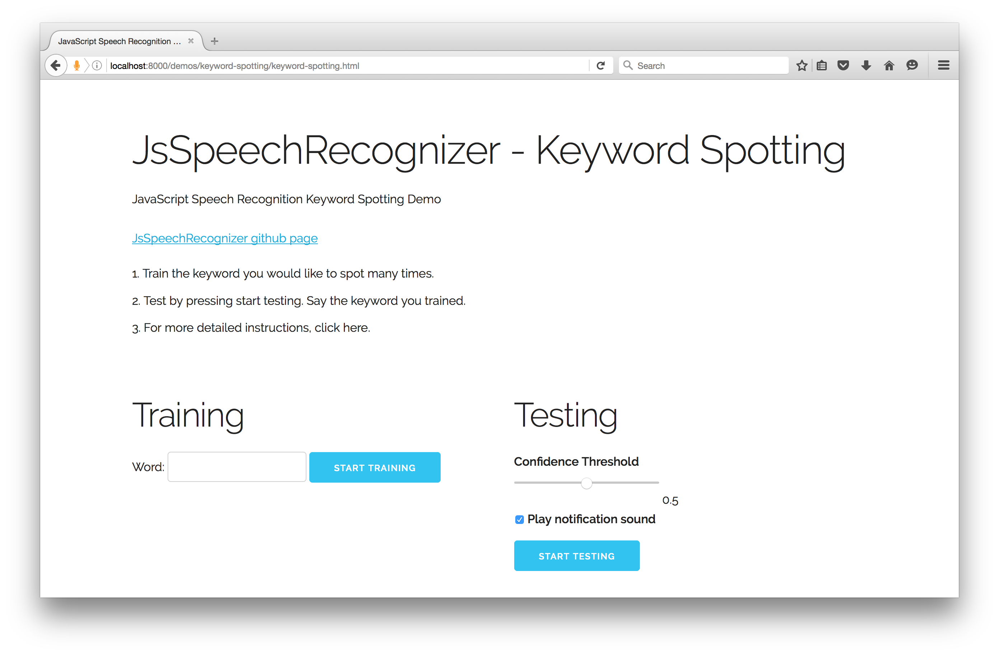

# JsSpeechRecognizer Keyword Spotting

Train the Speech Recognizer to recognize a spoken keyword.

[Keyword Spotting Live Demo](https://dreamdom.github.io/demos/keyword-spotting/keyword-spotting.html)

## Video
Here is a [short video](https://vimeo.com/161142124) that shows how to run the demo.

## Screenshot

## Instructions

1. Train the word you would like to recognize several times. For example train "Zoey" five times.
2. Click the "start testing" button. The recognizer is now continuously listening for the word "Zoey".
3. Say the word "Zoey". A notification will sound when the word is recognized.
4. The recognized word will also appear in the testing section. Clicking the "Play" button next to the word will play the audio clip the recognizer identified as the keyword.

## Tips and Things to Try

1. If you are getting too many false positives, try increasing the confidence threshold.
2. If you aren't getting any matches, try lowering the confidence threshold.
3. Try varying the amounts of training entries.
4. Clone the code, and then in file keyword-spotting.html try changing the group size and the number of groups.
5. Experiment with different words and phrases. Some shorter words may generate a lot of false positives. Some longer words or phrases are more unique sounding.
6. Train and test in a quiet room. The recognizer does not currently handle background noise well.
