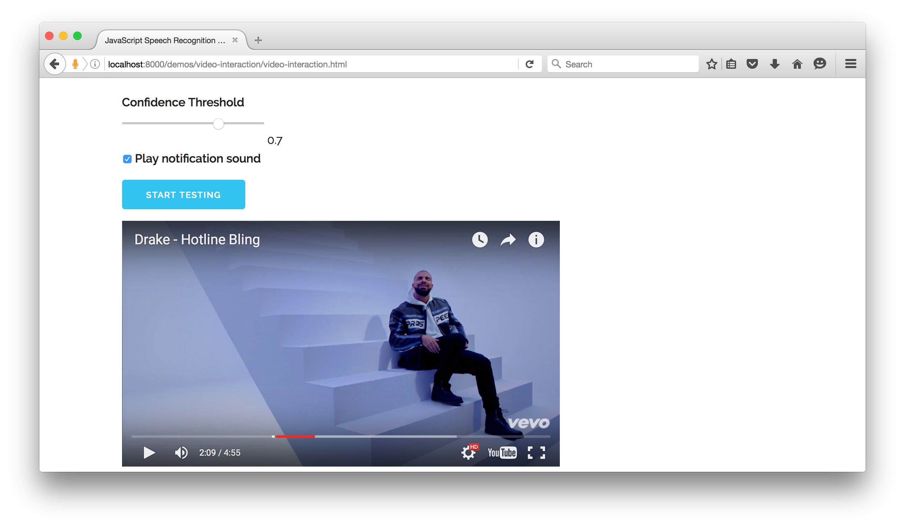

# JsSpeechRecognizer Video Interaction

Interact with a video using your voice.

[Video Interaction Live Demo](https://dreamdom.github.io/demos/video-interaction/video-interaction.html)

## Video
Here is a [short video](https://vimeo.com/161726625) that shows how to run the demo.

## Screenshot

## Instructions
1. Train the phrase "Like It" several times.
2. Click the "start testing" button. The recognizer is now continuously listening for the phrase "Like It"
3. Say the phrase "Like It". A notification will sound when the word is recognized. A notification bar will appear near the bottom of the video.
4. Start playing the video. Try saying the phrase "Like It" again.

## Tips and Things to Try
1. Try adjusting the confidence threshold up and down.
2. Try training a different phrase.
3. Try testing at different volume levels.
4. Try testing while playing audio from different sources.

## Final Notes
At the moment I have only tried testing on one computer. Also I have only tested in Firefox and Chrome.
